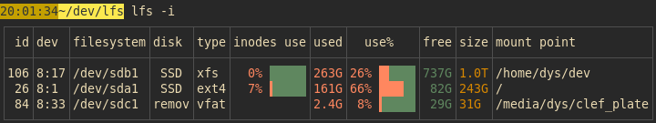

# lfs

[![CI][s3]][l3] [![MIT][s2]][l2] [![Latest Version][s1]][l1] [![Chat on Miaou][s4]][l4]

[s1]: https://img.shields.io/crates/v/lfs.svg
[l1]: https://crates.io/crates/lfs

[s2]: https://img.shields.io/badge/license-MIT-blue.svg
[l2]: LICENSE

[s3]: https://travis-ci.org/Canop/lfs.svg?branch=master
[l3]: https://travis-ci.org/Canop/lfs

[s4]: https://miaou.dystroy.org/static/shields/room.svg
[l4]: https://miaou.dystroy.org/3768?Rust


A linux utility listing your filesystems.


Besides traditional columns, the `disk` column helps you identify your "disk" (or the mapping standing between your filesystem and the physical device) :

* `remov` : a removable device (such as an USB key)
* `HDD` : a rotational disk
* `SSD` : a solid state storage device
* `RAM` : an in-memory device (such as zram)
* `LVM` : a device mapped to one or several disks using LVM
* `crypt` : a crypted disk

All sizes are normally based on the current SI recommendations (1M is one million bytes) but can be changed with `--units binary` (then 1M is 1,048,576 bytes).

## Installation

### Precompiled binary

You can download it from https://github.com/Canop/lfs/releases

### From source

You need the [Rust tool chain](https://rustup.rs/).

```
cargo install lfs
```

### Arch Linux

**lfs** can be installed from the [community repository](https://archlinux.org/packages/community/x86_64/lfs/):

```
pacman -S lfs
```

## Usage

```
lfs
```

### All filesystems

By default, **lfs** only shows the "normal" storage filesystems, backed by physical block devices and not bound to another mount point.

To show them all, use

```
lfs -a
```

### JSON

To get the output as JSON, do `lfs -j` or  `lfs -a -j`.

Here's an example output, with comments:

```js
[
  { // one entry per filesystem
    "dev": { // device id, commonly represented as 8:1
      "major": 8,
      "minor": 1
    },
    "disk": {
      "crypted": false,
      "ram": false, // true for memory disks
      "removable": false,
      "rotational": false, // true for HDD
      "type": "SSD" // human readable disk type
    },
    "fs": "/dev/sda1",
    "fs-label": null, // not null when the fs is labelled
    "fs-type": "ext4",
    "id": 26, // filesystem id
    "mount-point": "/",
    "stats": {
      "available": "82G", // human readable available space
      "bavail": 19973841, // number of free blocks for underprivileged users
      "bfree": 23000170, // number of free blocks
      "blocks": 59233748, // total number of blocks
      "bsize": 4096, // size of a block, in bytes
      "favail": 14088395, // number of free inodes for underprivileged users
      "ffree": 14088395, // number of free inodes
      "files": 15114240, // total number of inodes
      "size": "243G", // disk size, for humans, SI unit
      "used": "161G", // used space, SI unit
      "used-percent": "66%"
    }
  }
]
```

### Find the filesystem you're interested into

You may pass a path to have only the relevant device shown.
For example:


### Show labels

Labels aren't frequently defined, or useful, so they're not displayed by default.

Use `--labels` or `-l` to display them in the table:


### Show inodes

To display inodes use, use `--inodes` or `-i`:



### Other options

Use `lfs --help` to list the other arguments.

## Internals

If you want to display the same data in your Rust application, have a look at the [lfs-core](https://docs.rs/lfs-core/) crate.
