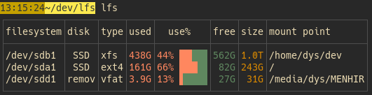
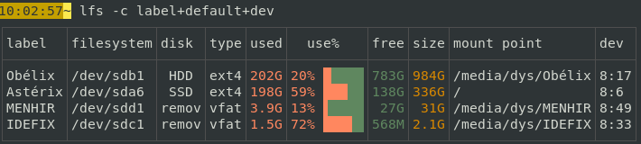
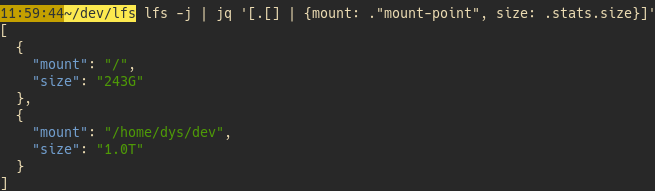
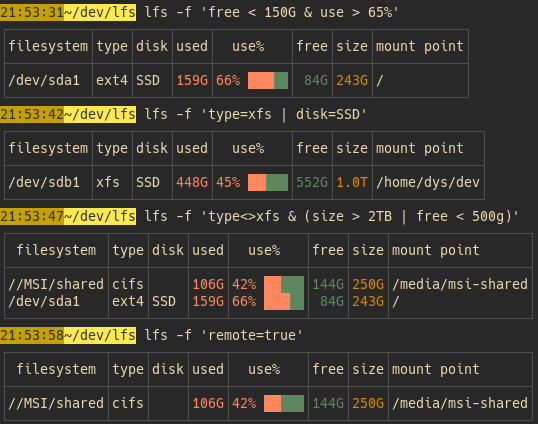
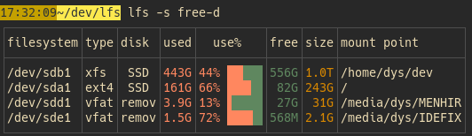

# lfs

[![CI][s3]][l3] [![MIT][s2]][l2] [![Latest Version][s1]][l1] [![Chat on Miaou][s4]][l4]

[s1]: https://img.shields.io/crates/v/lfs.svg
[l1]: https://crates.io/crates/lfs

[s2]: https://img.shields.io/badge/license-MIT-blue.svg
[l2]: LICENSE

[s3]: https://travis-ci.org/Canop/lfs.svg?branch=master
[l3]: https://travis-ci.org/Canop/lfs

[s4]: https://miaou.dystroy.org/static/shields/room.svg
[l4]: https://miaou.dystroy.org/3768?Rust

A linux utility listing your filesystems.

Complete documentation lives at **[https://dystroy.org/lfs](https://dystroy.org/lfs)**

* **[Overview](https://dystroy.org/lfs/)**
* **[Installation](https://dystroy.org/lfs/install)**

### Default table

### Custom choice of column

### JSON output

(you can output the table as CSV too)

### Filters

### Sort

