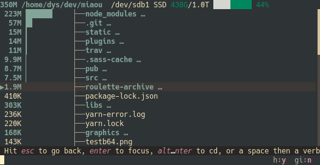

**lfs** is developed by [Denys Séguret](https://twitter.com/DenysSeguret), also known as [Canop](https://github.com/Canop) or [dystroy](https://dystroy.org).

# Chat

The best place to chat about lfs, to talk about features or bugs, is the Miaou chat.

* [Rust & lfs room on Miaou](https://miaou.dystroy.org/3490?rust)
* [French Programmers room on Miaou](https://miaou.dystroy.org/3)

# Issues

We use [GitHub's issue manager](https://github.com/Canop/lfs/issues).

Before posting a new issue, check your problem hasn't already been raised and in case of doubt please come first discuss it on the chat.

# Licence

**lfs** is licenced under the [MIT](https://raw.githubusercontent.com/Canop/lfs/master/LICENSE). Enjoy freely.

# API

**lfs** is built on top of [lfs-core](https://docs.rs/lfs-core/).

If you want to display the same data in your Rust application, consider using this crate directly.

For example **[broot](https://dystroy.org/broot)** uses lfs-core to display the available size in each folder's device:

