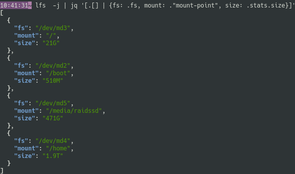

With `lfs --json` (shortened in `lfs -j`) you get a JSON structure that can be used in other programs.

# Raw output

Here's a sample, that I could get with `lfs -j > disks.json`:

```JSON
[
  {
    "bound": false,
    "dev": {
      "major": 8,
      "minor": 1
    },
    "disk": {
      "crypted": false,
      "ram": false,
      "removable": false,
      "rotational": false,
      "type": "SSD"
    },
    "fs": "/dev/sda1",
    "fs-label": null,
    "fs-type": "ext4",
    "id": 26,
    "mount-point": "/",
    "stats": {
      "available": "81G",
      "bavail": 19668017,
      "bfree": 22694346,
      "blocks": 59233748,
      "bsize": 4096,
      "inodes": {
        "avail": 13901150,
        "files": 15114240,
        "free": 13901150,
        "used-percent": "8%"
      },
      "size": "243G",
      "used": "162G",
      "used-percent": "67%"
    }
  },
  {
    "bound": false,
    "dev": {
      "major": 8,
      "minor": 17
    },
    "disk": {
      "crypted": false,
      "ram": false,
      "removable": false,
      "rotational": false,
      "type": "SSD"
    },
    "fs": "/dev/sdb1",
    "fs-label": null,
    "fs-type": "xfs",
    "id": 106,
    "mount-point": "/home/dys/dev",
    "stats": {
      "available": "558G",
      "bavail": 136303656,
      "bfree": 136303656,
      "blocks": 244071157,
      "bsize": 4096,
      "inodes": {
        "avail": 487292182,
        "files": 488380736,
        "free": 487292182,
        "used-percent": "0%"
      },
      "size": "1.0T",
      "used": "441G",
      "used-percent": "44%"
    }
  }
]
```

# All filesystems

As for the table view, the JSON is by default limited to "normal" storage devices.

You can get the complete list with `lfs --json --all`.

# Pipe

The output of `lfs -j` can be piped into another program.

You can for example use [jq](https://stedolan.github.io/jq/) to filter or extract data:



