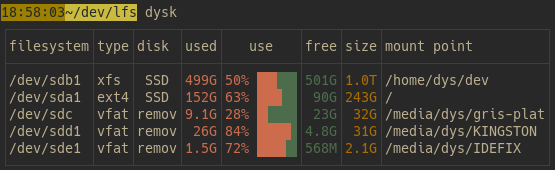
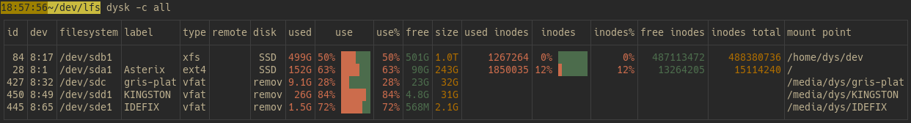
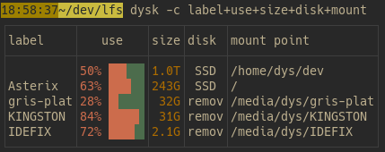
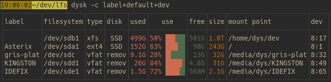
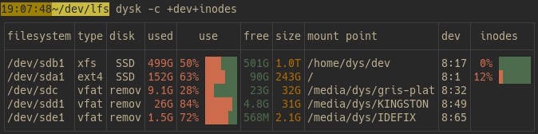
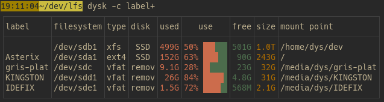
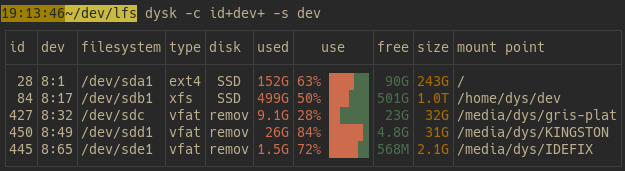
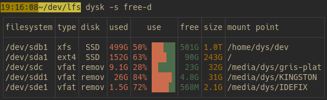
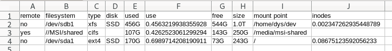

The standard output of dysk is a table with a default set of columns and only the "normal looking" filesystems.
You can modify it easily.

# Columns

You can run `dysk --list-cols` for the list of all columns.

## All columns

name | default | meaning
-|-|-
id | | mount point id
dev | | device id
filesystem | ✓ | filesystem
label |  | label
type | ✓ | filesystem type
remote | | whether it's a remote filesystem
disk | ✓ | short tag of the underlying storage identified
used | ✓ | cumulated size of the occupied blocks
use | ✓ | graphical view of the use share
use_percent |  | percentage of occupied blocks
free | ✓ | cumulated size of the available blocks
free_percent |  | percentage of available blocks
size | ✓ | size of the volume
inodesfree |  | available inodes
inodesused |  | inodes used
inodes |  | inodes use share, graphical
inodes_use_percent |  | inodes use share, in percents
inodescount |  | total number of inodes in the filesystem
mount | ✓ | mounting path
uuid |  | filesystem's UUID
partuuid |  | partition's UUID
options |  | linux mount options
compress |  | compression algorithm/level


## Choose columns

With the `--cols` launch argument, shortened as `-c`, you can change the displayed columns or their order.

The default set is defined for the casual usage of checking the available volumes and their filling level:



With `-c all`, you may see all available columns, but that's normally too much for convenience:



The most obvious use of the `--cols` argument is the explicit definition of the columns to display.

For example `dysk -c label+use+size+disk+mount` will show the `label`, `use`, `size`, `disk`, and `mount` columns, in that order:



All the default columns (see [table above](#columns)) can be inserted with just `default`.

Here's adding the label at the start and the device id at the end, with `dysk -c label+default+dev`:




If the `--cols` argument starts or ends with `+` or `-`, the `default` set of columns is implied.
To add the device id and the share of inodes used to the default columns, you do `dysk -c +dev+inodes`:



To preprend the `label` column before the default ones, use `dysk -c label+`:


The `-` sign removes columns.
And adding an already present column moves it to the end (there's never duplicates).

Here's removing the `fs` column and moving the `type` column to the end, with `dysk -c -fs+type`:




# Sort

With the `--sort` launch argument, shortened as `-s`, you can specify the order of displayed rows.

The argument's value must be either a column name, for example `dysk -s dev`, or a column name and a direction, for example `dysk --sort size-desc`.

The `desc` and `asc` directions can be abbreviated into `d` and `a`.

For example, sorting on the device id:



Or sorting on the remaining free space, in descending order:



# CSV

With the `--csv` argument, you can ask dysk to output the table in CSV:

```bash
dysk --csv > mounts.csv
```

You may choose the separator with the `--csv-separator` argument.

Filters, sorting, and column selection work the same than for standard tables so you may do this:

```bash
dysk --csv -f 'size>100G' -c remote+default+inodes > mounts.csv
```
which would give something like this:



