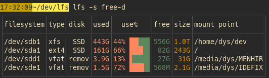

The standard output of lfs is a table with a default set of columns and only the "normal looking" filesystems.
You can modify it easily.

# Columns

You can run `lfs --list-cols` for the list of all columns.

## All columns

name | default | meaning
-|-|-
id | | mount point id
dev | | device id
filesystem | ✓ | filesystem
label |  | label
type | ✓ | filesystem type
disk | ✓ | short tag of the underlying storage identified
used | ✓ | cumulated size of the occupied blocks
use | ✓ | graphical view of the use share
use_percent |  | percentage of occupied blocks
free | ✓ | cumulated size of the available blocks
size | ✓ | size of the volume
inodesfree |  | available inodes
inodesused |  | inodes used
inodes |  | inodes use share, graphical
inodes_use_percent |  | inodes use share, in percents
inodescount |  | total number of inodes in the filesystem
mount | ✓ | mounting path

## Choose columns

With the `--cols` launch argument, shortened as `-c`, you can change the displayed columns or their order.

The default set is defined for the casual usage of checking the available volumes and their filling level:

With `-c all`, you may see all available columns, but that's normally too much for convenience:

The most obvious use of the `--cols` argument is the explicit definition of the columns to display.

For example `lfs -c label+use+size+disk+mount` will show the `label`, `use`, `size`, `disk`, and `mount` columns, in that order:

All the default columns (see [table above](#columns)) can be inserted with just `default`.

Here's adding the label at the start and the device id at the end, with `lfs -c label+default+dev`:

If the `--cols` argument starts or ends with `+` or `-`, the `default` set of columns is implied.
To add the device id and the share of inodes used to the default columns, you do `lfs -c +dev+inodes`:

To preprend the `label` column before the default ones, use `lfs -c label+`:

The `-` sign removes columns.
And adding an already present column moves it to the end (there's never duplicates).

Here's removing the `fs` column and moving the `type` column to the end, with `lfs -c -fs+type`:

# Rows

The default selection of filesystems showcases your storage, avoiding any filesystem with no "disk", bound to another filesystem, etc.

If you're only interested in the device on which some file is, give the path as argument.

For example, for the current device, use `lfs .`:

To see *all* filesystems of your system, do `lfs --all`:

This list can be quite big with virtual file systems, docker use, etc.

## Sort

With the `--sort` launch argument, shortened as `-s`, you can specify the order of displayed rows.

The argument's value must be either a column name, for example `lfs -s dev`, or a column name and a direction, for example `lfs --sort size-desc`.

The `desc` and `asc` directions can be abbreviated into `d` and `a`.

For example, sorting on the device id:

Or sorting on the remaining free space, in descending order:

