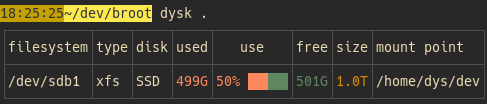

There are several ways to choose the filesystems of either the table or the JSON output:

* [Choose between the "normal" ones or all of them](#normality)
* [Select the filesystem containing a specific path](#current-filesystem)
* [Use the rich query syntax of the `--filter` argument](#filter-argument)

# Normality

The default selection of filesystems showcases your storage, avoiding any filesystem which both have no "disk" and aren't remote ones, bound to another filesystem, etc.


Here are the rules of the current heuristics, in order: a filesystem

1. is excluded when it's bound to a previous one
1. is excluded when it's of type `squashfs`
1. is included when it's of type `zfs`
1. is included when it's remote
1. is excluded when no underlying disk was found

To see *all* filesystems of your system, do `dysk --all`:


This list can be quite big with virtual file systems, docker use, etc.

# Current filesystem

If you're only interested in the device on which some file is, give the path as argument.

For example, for the current device, use `dysk .`:



# Filter argument

The `--filter` argument, shortened in `-f`, lets you specify a constraint, or combine several ones.

A constraint can be related to any [column](../table#all-columns).

You can for example fetch the filesystems with a given type with `dysk -f 'type=xfs'`.

Or remote volumes with `dysk -f 'remote=true'`.

The operators you can apply to a column are the following ones:

|operator|meaning|
|-|-|
|<| lower
|<=| lower or equal
|>| greater
|>=| greater or equal
|<>| different
|=| somehow equal - for example `fs=sda` matches `/dev/sda1`
|==|really equal

You can combine several column conditions with boolean operators `|` (or), `&` (and) and `!` (not) and if needed you can use parenthesis.

For example you may want to select the volumes with not enough space with

```bash
dysk -f 'free<100G | use>65%'
```

Examples:


**Note:**
Only *normal* filesystems are shown unless you use `-a`. This applies even when you use the `--filter` argument.

